# Pipeline Diagram (Mermaid)

```mermaid
flowchart TD
    A[Raw LR Image<br/>128×128, noisy] --> B[Preprocessing<br/>No normalization<br/>Keep out-of-range values]
    B --> C[SwinIR-lite Encoder<br/>Conv 3×3 → 60 ch]
    C --> D[RSTB Block 1<br/>6× Swin Transformer<br/>Window=8, Shifted]
    D --> E[RSTB Block 2<br/>6× Swin Transformer]
    E --> F[RSTB Block 3<br/>6× Swin Transformer]
    F --> G[RSTB Block 4<br/>6× Swin Transformer]
    G --> H[Conv 3×3<br/>Skip Connection]
    H --> I[PixelShuffle 2×<br/>Upsample 128→256]
    I --> J[Conv 3×3<br/>Output 1 ch]
    J --> K[Clamp [0, 1]<br/>Restored 256×256]
    
    K --> L[Loss Computation]
    L --> M[Charbonnier L1<br/>Weight: 1.0]
    L --> N[Frequency FFT<br/>Weight: 0.05]
    M & N --> O[Total Loss<br/>Backprop]
    
    style A fill:#ffe4b5
    style K fill:#98fb98
    style O fill:#ffb6c1
```

---

## Training Pipeline

```mermaid
flowchart LR
    A[Paired Dataset<br/>3200 GT + LR] --> B[Train/Val Split<br/>90/10]
    B --> C[DataLoader<br/>Batch=16, Shuffle]
    C --> D[Augmentation<br/>Flip, Rot90 sync]
    D --> E[SwinIR-lite<br/>FP16 Forward]
    E --> F[Loss: L1 + Freq]
    F --> G[AdamW Step<br/>Cosine LR]
    G --> H[TensorBoard Log<br/>PSNR/SSIM Val]
    H --> I[Checkpoint<br/>Best/Last]
    I --> J[Evaluate.py<br/>Test Inference]
    J --> K[400 Outputs<br/>256×256 .npy]
```



---

## Data Flow (Shapes)

| Stage | Input Shape | Output Shape | Notes |
|-------|-------------|--------------|-------|
| Load LR | (B, 1, 128, 128) | — | Values in [-0.003, 1.54] |
| Conv First | (B, 1, 128, 128) | (B, 60, 128, 128) | Shallow features |
| PatchEmbed | (B, 60, 128, 128) | (B, 16384, 60) | 128×128 patches |
| 4× RSTB | (B, 16384, 60) | (B, 16384, 60) | Deep features |
| PatchUnEmbed | (B, 16384, 60) | (B, 60, 128, 128) | Back to spatial |
| Conv After | (B, 60, 128, 128) | (B, 60, 128, 128) | Residual |
| PixelShuffle 2× | (B, 60, 128, 128) | (B, 15, 256, 256) | 2× upsample |
| Conv Last | (B, 15, 256, 256) | (B, 1, 256, 256) | Final output |
| Clamp | (B, 1, 256, 256) | (B, 1, 256, 256) | Range [0, 1] |

---

## Augmentation Pipeline (Synchronized)

```
GT (256×256) ──────┬──► HFlip (p=0.5) ──┬──► VFlip (p=0.5) ──┬──► Rot90 (p=0.5) ──┬──► Brightness (p=0.2) ──► Tensor
                   │                    │                    │                    │
LR (128×128) ──────┼──► HFlip (p=0.5) ──┼──► VFlip (p=0.5) ──┼──► Rot90 (p=0.5) ──┼──► (NO photometric) ───► Tensor
                   │                    │                    │                    │
                   └────────────────────┴────────────────────┴────────────────────┘
                   
                   ✅ Perfect pixel alignment preserved
                   ✅ LR keeps real degradation (no synthetic noise added)
                   ✅ GT gets mild photometric variation for robustness
```